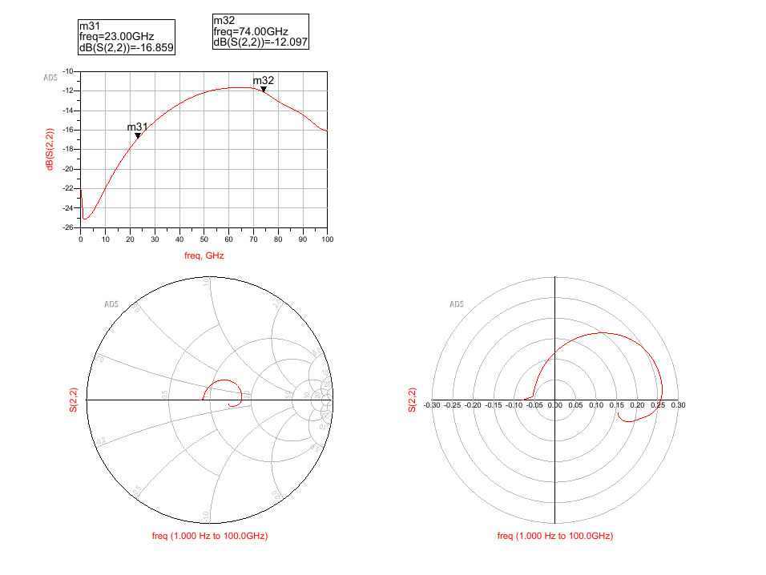

---
date:
  created: 2025-08-12
draft: 
categories:
  - RF
tags:
  - Transmission Line
authors:
  - why

---

# 这是50欧电阻接一段传输线之后的S22,可以判断传输线特征阻抗是大于50欧还是小于50欧吗

可以，通过分析史密斯圆图（Smith Chart）可以判断传输线的特征阻抗。

**结论是：传输线的特征阻抗大于50欧姆。**

以下是详细的分析步骤：

1.  **分析起点 (DC频率)**：
    *   这个电路的结构是在测试端口后连接一段传输线，传输线的末端接一个50欧姆的电阻作为负载。
    *   在直流 (DC) 或非常低的频率下，传输线的电长度趋近于零，可以将其视为一根导线。因此，测试端口看到的阻抗就是负载阻抗，即50欧姆。
    *   S22是反射系数。当负载阻抗（50欧姆）与系统参考阻抗（通常也是50欧姆）完全匹配时，反射系数为0。
    *   在史密斯圆图上，反射系数为0的点就是图的中心点。从图中左下角的史密斯圆图可以看出，红色曲线的起点（频率最低处）正是在圆心位置，这与理论分析相符。

2.  **分析频率增加时的轨迹变化**：
    *   当频率从零开始增加时，传输线的电长度变大，其阻抗变换的效应开始显现。
    *   观察史密斯圆图上的红色轨迹，它从中心点开始，随着频率的增加，向**上半圆**区域移动。
    *   史密斯圆图的上半圆代表**感性阻抗**（即阻抗的虚部为正，+jX），下半圆代表**容性阻抗**（即阻抗的虚部为负，-jX）。

3.  **得出结论**：
    *   一个基本的传输线理论是：当传输线的特征阻抗（Z₀）**大于**其负载阻抗（Zₗ）时，对于一小段传输线，其输入阻抗会呈现出**感性**。
    *   反之，如果传输线的特征阻抗（Z₀）**小于**其负载阻抗（Zₗ），其输入阻抗会呈现出**容性**。
    *   在这个案例中，负载阻抗 Zₗ = 50欧姆。由于S22的轨迹进入了代表感性阻抗的史密斯图上半圆，这表明输入阻抗是感性的。因此，我们可以断定传输线的特征阻抗 **Z₀ > Zₗ**，即 **Z₀ > 50欧姆**。

可以。  
关键并不是看 dB(S22) 的幅度，而是看 S22 在 Smith 图上的“起步方向”。  
步骤与原理如下：

1. 把测量系统归一化到 50 Ω。  
   终端电阻是 50 Ω，因此在传输线—电阻接口处的反射系数为  
   Γ₀＝(50 – Z₀)/(50 + Z₀)  
   • 若 Z₀＜50 Ω → Γ₀>0（与入射波同相）  
   • 若 Z₀＞50 Ω → Γ₀<0（与入射波反相）

2. 在频率很低时，线路电气长度 βl≈0，测得的 Γ≈0。  
   频率稍稍升高(βl 有了微小增量)后，  
   Γ_in = Γ₀·e^(–j2βl)

   • 若 Γ₀>0，e^(–j2βl) 带来一点负相位 → 曲线先掉到 Smith 图下半平面（负虚部，电容性）；  
   • 若 Γ₀<0，曲线则先跑到上半平面（正虚部，电感性）。

3. 观察图中红色轨迹  
   • 从中心开始后首先进入实轴上侧，说明它一开始呈电感性 → Γ₀ 为负 → Z₀>50 Ω。  

4. 用 |Γ| 估个量级  
   幅度最大约 –12 dB → |Γ|≈0.25。  
   Z₀ = 50 Ω·(1 – |Γ|)/(1 + |Γ|) ≈ 50×0.75/1.25 ≈ 30 Ω。  
   （这里只是粗算，实际还要考虑走线损耗、连接过渡等。）

结论  
这段传输线的特征阻抗明显小于 50 Ω，大约在 30 ~ 40 Ω 左右。