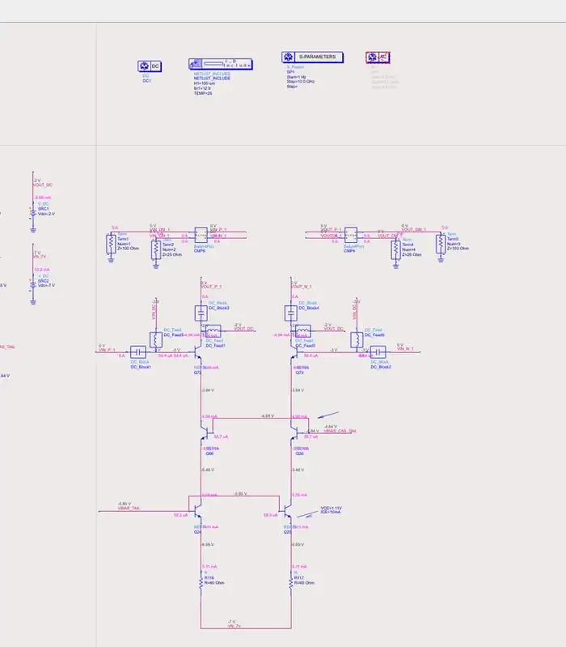
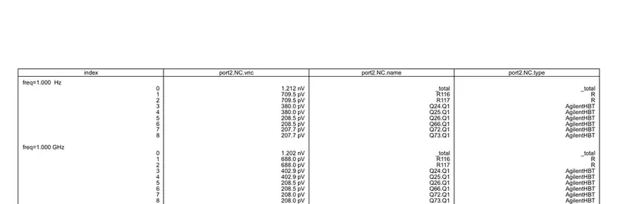
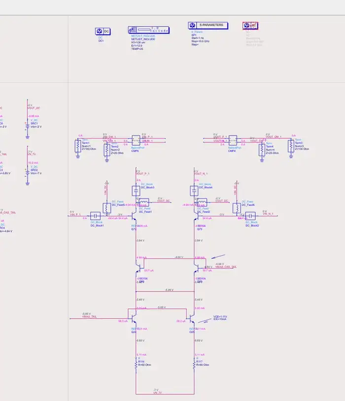
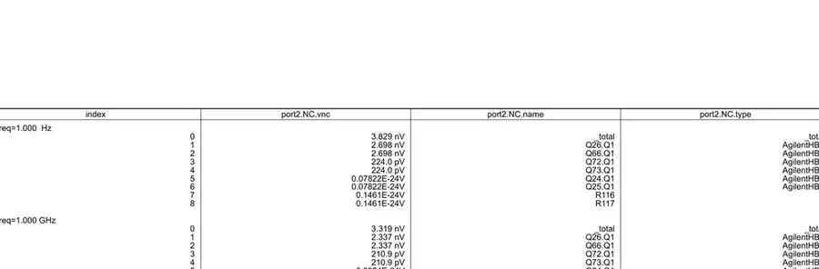

# 共享 cascode emitter 会破坏差模局部反馈并恶化伪差分放大器输出噪声

## 问题

对于一个伪差分 BJT 放大器，尾电流 cascode 有两种连接方式：

1. **独立 emitter 结构**：左右两支路的 cascode 管 emitter 彼此独立；
2. **共享 emitter 结构**：左右两只 cascode 管 emitter 直接短接。

两种结构的 DC 工作点接近，但 ADS Noise Contribution 显示：共享 emitter 后，差分输出总噪声明显变差。

本文要回答的核心问题是：

1. 为什么共享 emitter 后，Q66/Q26 的输出噪声贡献会显著上升？
2. 为什么 Q24/Q25、R116/R117 的差分噪声贡献反而几乎消失？
3. 这一现象对应的普适物理规律是什么？

## 前提与定义

- 分析对象为 **差分输出噪声**，不是单端噪声。
- ADS 表格中的 `port2.NC.vnc` 可视为各器件对差分输出端口的输出噪声贡献。
- 本文先使用低频简化小信号模型解释主导机理，再讨论高频与完整晶体管模型的偏离。
- 为突出主效应，先忽略：
  - $r_o$；
  - $r_\pi$；
  - $C_\pi, C_\mu$；
  - 左右失配；
  - 负载与 bias 网络不对称。

## 简化算法

### 1. Observation

先直接看仿真现象。

#### 独立 emitter 结构

*图 1：独立 emitter 结构原理图。Q66/Q26 的 emitter 彼此独立，各自由下方尾电流支路驱动。*

*图 2：独立 emitter 结构的 ADS Noise Contribution。1 Hz 时 R116/R117、Q24/Q25 的贡献高于 Q66/Q26。*

1 Hz 时主要结果如下：

| 项目 | 噪声贡献 |
|---|---:|
| 总噪声 | 1.212 nV/√Hz |
| R116 / R117 | 709.5 pV/√Hz |
| Q24 / Q25 | 380.0 pV/√Hz |
| Q66 / Q26 | 208.5 pV/√Hz |
| Q72 / Q73 | 207.7 pV/√Hz |

#### 共享 emitter 结构

*图 3：共享 emitter 结构原理图。Q66/Q26 的 emitter 被直接连接到同一个节点。*

*图 4：共享 emitter 结构的 ADS Noise Contribution。1 Hz 时 Q66/Q26 成为主导噪声源，而 Q24/Q25、R116/R117 的差分贡献接近零。*

1 Hz 时主要结果如下：

| 项目 | 噪声贡献 |
|---|---:|
| 总噪声 | 3.829 nV/√Hz |
| Q26 / Q66 | 2.698 nV/√Hz |
| Q72 / Q73 | 224.0 pV/√Hz |
| Q24 / Q25 | 近似 0 |
| R116 / R117 | 近似 0 |

因此：

- **直接观察 1**：总差分输出噪声由 1.212 nV/√Hz 增加到 3.829 nV/√Hz，约增加 $3.16\times$，即约 10 dB。
- **直接观察 2**：Q66/Q26 的单管噪声贡献由 208.5 pV/√Hz 增加到 2.698 nV/√Hz，约增加
  $$
  \frac{2.698\ \mathrm{nV}}{208.5\ \mathrm{pV}}\approx 12.94,
  $$
  即约 22.2 dB。
- **直接观察 3**：Q24/Q25、R116/R117 并不是“无噪声”，而是其对 **差分输出** 的贡献几乎消失。

### 2. 一阶物理判断

如果只是“尾电流源噪声更小”，总噪声本应下降；但实际总噪声反而上升，说明关键不在噪声源本身，而在于：

> **共享 emitter 改变了噪声到差分输出的传递函数。**

更具体地说：

- 独立 emitter 时，每一支路都有各自的 emitter local feedback；
- 共享 emitter 时，这个局部反馈只剩下对 **共模电流** 有效，对 **差模电流** 不再有效。

这给出一个快速判断：

> **共享 emitter 很可能削弱 Q66/Q26 自身噪声的抑制，却把 Q24/Q25、R116/R117 的噪声推向共模。**

下面用严格的小信号推导验证这一点。

## 严格算法

### 1. 独立 emitter：每支路都有局部负反馈

将每个 cascode emitter 向下看到的尾电流支路等效为阻抗

$$
Z_T(s), \qquad Y_T(s)=\frac{1}{Z_T(s)}.
$$

令：

- $i_{nc}$：cascode 管自身等效噪声电流；
- $i_{nt}$：下级尾电流支路等效噪声电流；
- $v_e$：cascode emitter 小信号电压。

由于基极偏置近似为 AC ground，可写

$$
i_c=i_{nc}-g_m v_e \tag{1}
$$

下方尾电流支路满足

$$
i_c=Y_Tv_e+i_{nt}. \tag{2}
$$

联立得

$$
v_e=\frac{i_{nc}-i_{nt}}{g_m+Y_T}. \tag{3}
$$

代回可得 collector 电流

$$
i_c=
\frac{1}{1+g_mZ_T}i_{nc}
+
\frac{g_mZ_T}{1+g_mZ_T}i_{nt}. \tag{4}
$$

于是：

- 对 cascode 自身噪声：
  $$
  H_{nc}=\frac{1}{1+g_mZ_T}; \tag{5}
  $$
- 对下级尾电流支路噪声：
  $$
  H_{nt}=\frac{g_mZ_T}{1+g_mZ_T}. \tag{6}
  $$

当 $g_mZ_T\gg 1$ 时：

$$
H_{nc}\ll 1,\qquad H_{nt}\approx 1.
$$

#### Physical Interpretation

这意味着：

- Q66/Q26 自身噪声会先激发 emitter 电压，再通过 $-g_mv_e$ 形成反向电流，因此被局部反馈抑制；
- Q24/Q25、R116/R117 的噪声则更容易被传递到输出。

这与图 2 的 Observation 一致。

### 2. 共享 emitter：差模局部反馈消失

共享 emitter 时：

$$
v_{e1}=v_{e2}=v_e. \tag{7}
$$

两支路 collector 电流分别为

$$
i_{c1}=i_{nc1}-g_mv_e, \tag{8}
$$

$$
i_{c2}=i_{nc2}-g_mv_e. \tag{9}
$$

公共 emitter 节点 KCL：

$$
i_{c1}+i_{c2}=2Y_Tv_e+i_{nt1}+i_{nt2}. \tag{10}
$$

因此

$$
v_e=
\frac{i_{nc1}+i_{nc2}-i_{nt1}-i_{nt2}}
{2(g_m+Y_T)}. \tag{11}
$$

差分输出电流为

$$
i_{od}=i_{c1}-i_{c2}.
$$

将式 (8)、(9) 相减，得到

$$
i_{od}=i_{nc1}-i_{nc2}. \tag{12}
$$

这是最关键的结果。

#### Physical Interpretation

式 (12) 说明：

- $i_{nt1}, i_{nt2}$ 主要只影响 **总电流/共模电流**；
- 对差分输出而言，下级尾电流支路噪声不再显式进入结果；
- cascode 自身噪声却以近似 unity differential transfer 的方式直接出现在输出。

这正对应图 4 的 Observation：Q24/Q25、R116/R117 的差分贡献接近零，而 Q66/Q26 变成主导噪声源。

### 3. 差模虚地视角

共享 emitter 的另一种快速理解方式是 odd-mode half-circuit。

对于理想差模扰动，公共 emitter 节点无法同时承受左右相反电压，因此在差模下近似有

$$
v_e\approx 0. \tag{13}
$$

于是对 cascode 自身噪声：

$$
i_c=i_{nc}-g_mv_e\approx i_{nc}. \tag{14}
$$

即：

> **共享 emitter 节点在差模下近似成为 AC virtual ground，从而破坏了原本的 emitter local feedback。**

## ADS/仿真实现

### 已知

- 仿真工具：ADS；
- 关注指标：差分输出端口 `port2` 的 Noise Contribution；
- 已给出的对比频点：1 Hz 与 1 GHz；
- 比较对象：独立 emitter 与共享 emitter 两种尾电流 cascode 连接方式。

### 证据保留

本笔记保留了四张最小证据集图片：

1. 独立 emitter 原理图；
2. 独立 emitter Noise Contribution；
3. 共享 emitter 原理图；
4. 共享 emitter Noise Contribution。

其余重复截图未保留。

## 仿真现象解释

### Observation → Derivation → Physical Interpretation

#### 现象 1：Q24/Q25、R116/R117 的差分贡献几乎消失

- **Observation**：共享 emitter 后，Q24/Q25 与 R116/R117 在 `port2.NC.vnc` 中接近数值零。
- **Derivation**：式 (12) 中差分结果只保留 $i_{nc1}-i_{nc2}$，而 $i_{nt1}, i_{nt2}$ 不再显式出现。
- **Physical Interpretation**：下级尾电流支路噪声主要被转化为共模电流，因此在理想差分输出中被抵消。

需要强调：这不表示这些器件“没有噪声”，而是表示它们的噪声 **没有以差模形式显著出现在当前测量端口**。

#### 现象 2：Q66/Q26 的差分贡献显著增大

- **Observation**：Q66/Q26 由约 208.5 pV/√Hz 增至约 2.698 nV/√Hz。
- **Derivation**：独立 emitter 时，Q66/Q26 的噪声受 $1/(1+g_mZ_T)$ 抑制；共享 emitter 后，该抑制在差模下消失。
- **Physical Interpretation**：公共 emitter 节点只能对总电流/共模电流提供反馈，无法对差分电流提供独立修正。

#### 现象 3：总噪声变差而不是变好

- **Observation**：总噪声由 1.212 nV/√Hz 上升到 3.829 nV/√Hz。
- **Derivation**：虽然一部分底部噪声转为共模被抵消，但 cascode 自身噪声失去局部反馈抑制后成为主导项。
- **Physical Interpretation**：该拓扑并不是“降噪”，而是在重塑噪声模态与相关性。

### 当前电路结论 vs 一般规律

#### 当前电路结论

对这组 ADS 仿真：

- 共享 emitter 使总差分输出噪声约增加 10 dB；
- Q66/Q26 单管差分输出噪声贡献约增加 22 dB；
- Q24/Q25、R116/R117 的差分噪声贡献接近零。

#### 一般规律

只要两个 cascode emitter 的差模等效阻抗被明显拉低，就会削弱差模 emitter local feedback。一个更一般的近似是：若两个 emitter 之间跨接阻抗为 $Z_X$，则差模下可近似写成

$$
Z_{e,d}=Z_T\parallel\frac{Z_X}{2}, \tag{15}
$$

从而 cascode 自身噪声的差模传递近似为

$$
H_{nc,d}\approx\frac{1}{1+g_mZ_{e,d}}. \tag{16}
$$

因此：

- $Z_X\to\infty$：退化回独立 emitter 结构；
- $Z_X\to 0$：退化回共享 emitter 结构，差模局部反馈最弱。

## Design Insight

1. **“某一类噪声贡献消失”不等于“总噪声更小”。**
   如果一个拓扑同时改变噪声相关性和反馈路径，必须同时看 noise source 与 transfer function。

2. **共享节点会改变噪声的模态分布。**
   对底部尾电流源噪声，它更容易形成共模；对 cascode 自身噪声，它反而更容易形成差模。

3. **理想差分抵消在真实电路中可能被失配破坏。**
   即便 ADS 理想对称仿真中 Q24/Q25、R116/R117 的差分贡献接近零，真实芯片中的失配、寄生与负载不对称仍可能把共模噪声重新转换为差模噪声。

4. **不要只看 output noise。**
   最终设计还应同时检查 gain、input-referred noise、NF、CMRR、线性度与稳定性。

## 待验证项

1. 分别查看 `VOUT_P`、`VOUT_N` 的单端 Noise Contribution，验证下级尾电流支路噪声是否在两端主要表现为同相；
2. 在两个 emitter 之间引入参数化电阻 $R_X$，扫描
   $$
   1\ \Omega,\ 10\ \Omega,\ 100\ \Omega,\ 1\ \mathrm{k}\Omega,\ 10\ \mathrm{k}\Omega,\ \ldots
   $$
   直到近似开路，验证式 (15)、(16) 的趋势；
3. 在比较 output noise 的同时，进一步比较
   $$
   e_{n,\mathrm{in}}=\frac{e_{n,\mathrm{out}}}{|A_v|}
   $$
   以及最终 SNR / NF。

## 结论

对于本文伪差分放大器，可以将结论概括为：

> **独立 emitter 结构中，每支路都保留了自己的 emitter local feedback，因此 Q66/Q26 自身噪声到输出的差模传递约受 $1/(1+g_mZ_T)$ 抑制。**

而当两个 cascode emitter 直接相连时：

> **公共 emitter 节点在差模下近似成为 AC virtual ground，原先每支路独立的差模局部反馈消失；结果是下级尾电流支路噪声更偏向共模，而 Q66/Q26 自身噪声则以更强的差模形式直接出现在输出。**

因此，当前 case 中共享 emitter 不但没有降低总差分输出噪声，反而显著恶化了它。
