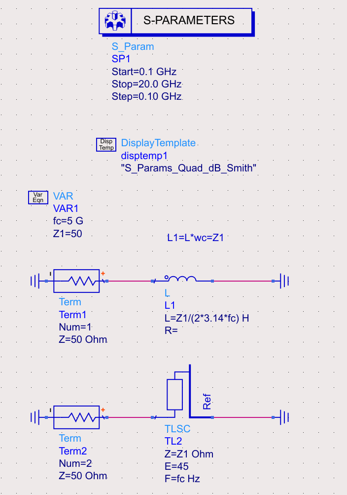
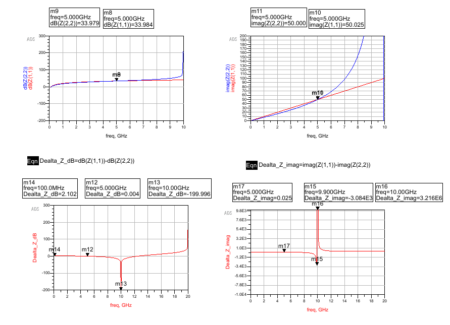
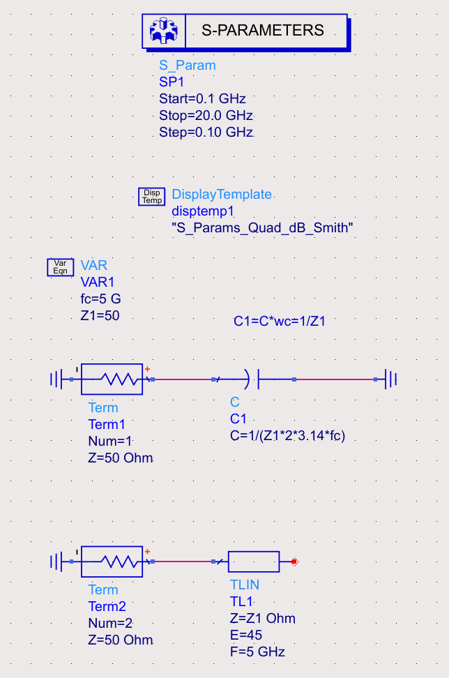
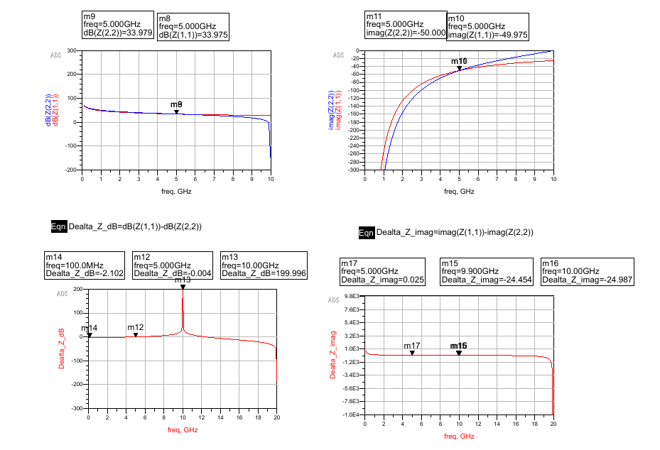

---
date:
  created: 2025-07-31
draft: 
categories:
  - RF
tags:
  - Transmission Line
authors:
  - why

---

# Richard_L_SP

fc=5GHz

0~5GHz内，传输线输入阻抗几乎和电感一样，所以在带内可以等效替代电感。
fc=5GHz时，
$$dB(Z(1,1))=dB(Z(2,2))$$

对fc=5GHz归一化后，
L1=L*wc=Z1

$$j*L1*Omega = j*Z1*tan(beta*l)$$

beta是相移常数

$$beta=2*pi/lambda$$

@w=wc,Omega=1

$$l=labmda/8,tan(beta*l)=tan(pi/4)=1$$

=> $$j*L1*Omega = j*Z1*tan(beta*l)$$在w=wc时相等

# Richard_C_SP

