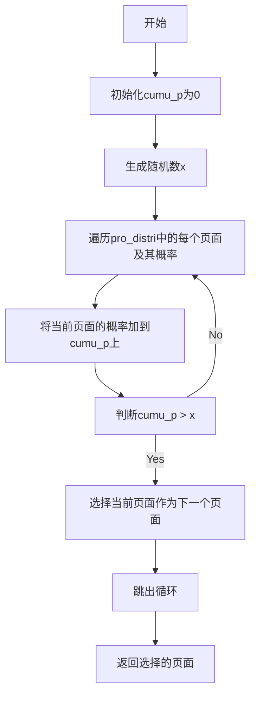

---
date:
  created: 2025-01-10
categories:
  - CS
tags:
  - Python
authors:
  - why
---

### 累积概率法的数学原理

累积概率法是一种用于根据概率分布随机选择元素的方法。其数学原理基于累积分布函数（Cumulative Distribution Function, CDF）。以下是详细的解释：

<!-- more -->

1. **概率分布**：
   - 假设有一个离散的概率分布，其中每个元素 \( p_i \) 有一个对应的概率 \( P(p_i) \)。
   - 例如，概率分布为 \( P(p_1) = 0.2 \)，\( P(p_2) = 0.3 \)，\( P(p_3) = 0.5 \)。

2. **累积概率**：
   - 累积概率是概率分布的累积和。累积概率 \( F(p_i) \) 表示选择元素 \( p_i \) 或更小的元素的概率。
   - 计算累积概率的方法是将概率分布中的每个概率值依次累加。
   - 对于上述例子，累积概率为：
     \[
     F(p_1) = P(p_1) = 0.2
     \]
     \[
     F(p_2) = P(p_1) + P(p_2) = 0.2 + 0.3 = 0.5
     \]
     \[
     F(p_3) = P(p_1) + P(p_2) + P(p_3) = 0.2 + 0.3 + 0.5 = 1.0
     \]

3. **生成随机数**：
   - 生成一个在0到1之间的随机数 \( x \)。

4. **选择元素**：
   - 遍历累积概率列表，找到第一个大于或等于随机数 \( x \) 的累积概率值。
   - 对应的元素即为选择的元素。

### 数学公式

假设概率分布为 \( P(p_1), P(p_2), \ldots, P(p_n) \)，累积概率 \( F(p_i) \) 可以表示为：
\[
F(p_i) = \sum_{j=1}^{i} P(p_j)
\]

选择元素的步骤可以表示为：
1. 生成随机数 \( x \in [0, 1] \)。
2. 找到最小的 \( i \) 使得 \( F(p_i) \geq x \)。
3. 选择元素 \( p_i \)。

### 应用在`sample_pagerank`函数中的数学原理

在`sample_pagerank`函数中，累积概率法用于根据`pro_distri`概率分布选择下一个页面。具体步骤如下：

1. **初始化累积概率**：
   - 初始化一个变量 `cumu_p` 为0。

2. **遍历概率分布**：
   - 遍历 `pro_distri` 字典中的每个页面及其对应的概率。

3. **累加概率**：
   - 将当前页面的概率加到 `cumu_p` 上。

4. **选择页面**：
   - 生成一个在0到1之间的随机数 `x`。
   - 遍历累积概率列表，找到第一个大于或等于 `x` 的累积概率值。
   - 对应的页面即为选择的下一个页面。

### Mermaid控制流图

这个控制流图展示了使用累积概率法选择下一个页面的具体逻辑流程。通过这种方式，可以确保每个页面被选择的概率与其在概率分布中的概率成正比。