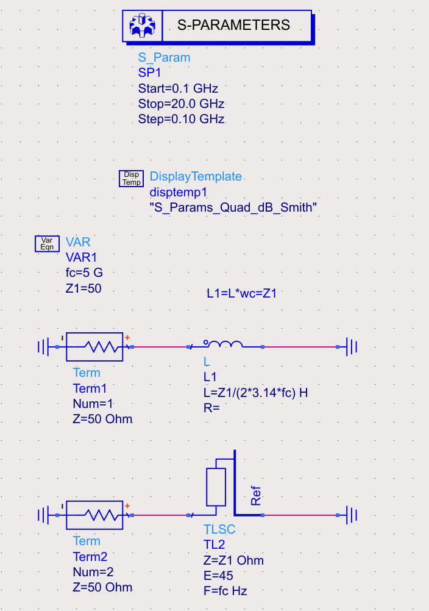
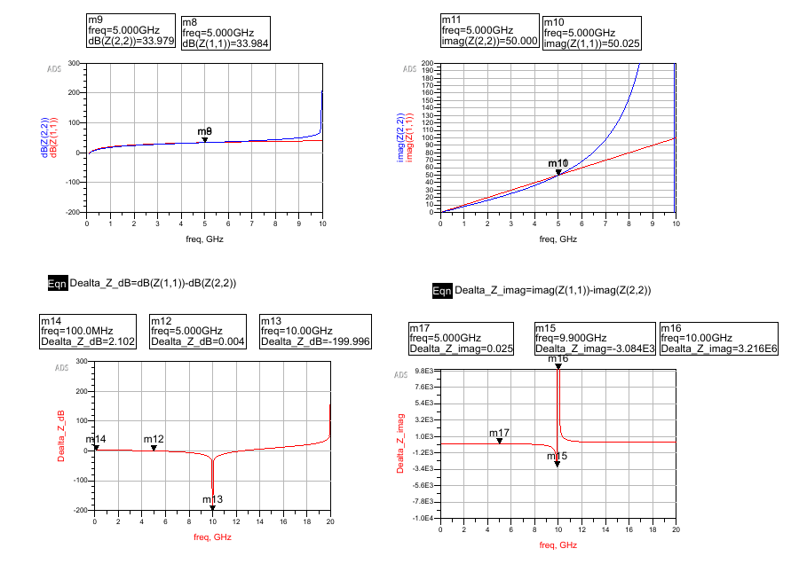
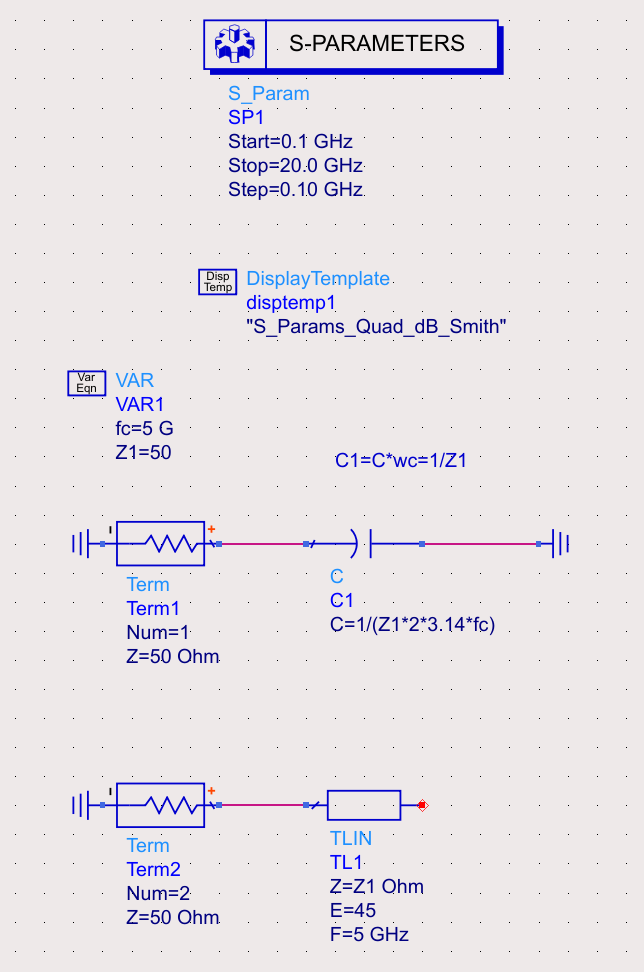
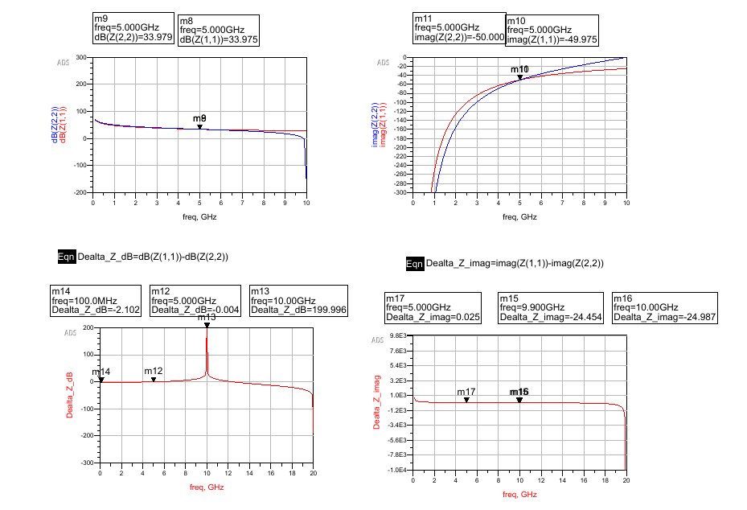

---
date:
  created: 2025-07-31
categories:
  - RF
tags:
  - Transmission Line
  - filter
  - Richards-transformation
authors:
  - why

---
<!-- more -->
# Richards 变换：用传输线实现集总电感与电容

本文记录以 ADS 仿真核对 Richards 变换的过程。图中的端口与电路参数以仿真工程为准。

## 已知、假设与待验证

- **已知：** 设计中心频率为 $f_c=5\,\text{GHz}$。
- **假设：** 传输线在 $f_c$ 的电长度为 $45^\circ$，并按无损线近似。
- **待验证：** 仅在设计频率附近比较等效性；远离该频点时，分布参数元件不会保持理想集总元件特性。

## 短路线等效电感

短路传输线的输入阻抗为 $Z_{in}=jZ_0\tan(\beta l)$。当电长度足够小时，它表现为感性；在 $f_c$ 处以归一化参数比较：

$$dB(Z(1,1))=dB(Z(2,2))$$

对 $f_c=5\,\text{GHz}$ 归一化后，

$$L_1=L\omega_c=Z_1$$

$$j*L1*Omega = j*Z1*tan(beta*l)$$

$\beta$ 是相移常数，$\beta=2\pi/\lambda$。在 $\omega=\omega_c$、$\Omega=1$ 且 $l=\lambda/8$ 时，$\tan(\beta l)=\tan(\pi/4)=1$，因此两者在中心频率相等。

## 开路线等效电容

开路传输线可在并联形式下表现为容性。以下仿真图用于核对其在中心频率附近的等效关系。

