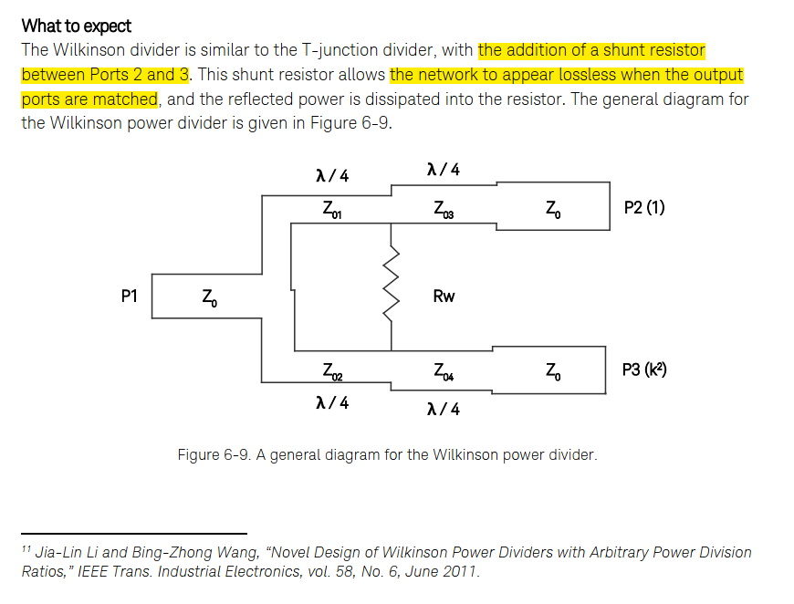

---
date:
  created: 2025-02-24
draft: 
categories:
  - RF
tags:
  - Divider
authors:
  - why

---
好的，我们来详细了解一下威尔金森（Wilkinson）功分器的原理和参考文献。

**Wilkinson功分器简介**

Wilkinson功分器是一种微波电路元件，常用于将输入功率平均（或其他比例）分配到两个或多个输出端口，同时保持所有端口的良好匹配，并且在输出端口之间提供良好的隔离。它由Ernest J. Wilkinson于1960年提出。

**Wilkinson功分器的基本结构（以两路等分功分器为例）**

一个标准的双路等功率分配Wilkinson功分器通常由以下部分组成：

1.  **输入端口（Port 1）**：信号输入端。
2.  **两个输出端口（Port 2 和 Port 3）**：信号输出端。
3.  **两条四分之一波长（λ/4）的传输线**：这两条传输线连接输入端口的分支点到两个输出端口。它们的特性阻抗 (Z_branch) 通常为 Z₀ * √2，其中 Z₀ 是系统的特性阻抗（通常为50Ω）。所以，这两条传输线的特性阻抗约为70.7Ω。
4.  **一个隔离电阻（R）**：这个电阻连接在两个输出端口之间。其阻值通常为 2 * Z₀ (即100Ω，对于50Ω系统)。

[图片可以搜索 "Wilkinson power divider schematic" 查看，大致是一个输入线，分叉成两条λ/4传输线到两个输出端口，两个输出端口之间跨接一个电阻。]

**Wilkinson功分器的原理**

Wilkinson功分器的核心优势在于它能同时实现端口匹配、功率分配和输出端口间的隔离。其工作原理可以通过“偶模”和“奇模”分析来理解：

1.  **功率分配与端口匹配（偶模分析）**
    *   **工作状态**：当信号从输入端口1进入时，理想情况下它会平均分配到输出端口2和端口3。
    *   **对称性**：由于结构的对称性，当信号从端口1输入时，端口2和端口3的电压和电流是同相且等幅的（假设是等分功分器）。
    *   **隔离电阻的作用**：在这种情况下，由于端口2和端口3的电位相同，隔离电阻R两端没有电位差，因此没有电流流过电阻，电阻不消耗功率。此时，隔离电阻如同开路。
    *   **阻抗变换**：两条λ/4传输线的特性阻抗为 Z_branch = Z₀ * √2。每条λ/4传输线将其负载阻抗Z₀（输出端口匹配）变换到其输入端（即分支点）的阻抗为 Z_in_branch = Z_branch² / Z₀ = (Z₀√2)² / Z₀ = 2Z₀² / Z₀ = 2Z₀。
    *   **输入匹配**：在分支点，这两条并联的2Z₀阻抗的总输入阻抗为 (2Z₀ || 2Z₀) = (2Z₀ * 2Z₀) / (2Z₀ + 2Z₀) = 4Z₀² / 4Z₀ = Z₀。因此，输入端口1也实现了与系统特性阻抗Z₀的匹配。
    *   **功率分配**：输入功率被平均分配到两个分支，由于端口匹配，每个输出端口得到输入功率的一半（-3dB，不考虑传输线损耗）。

2.  **输出端口间的隔离（奇模分析）**
    *   **工作状态**：考虑当端口2有信号输入（或反射），而端口1和端口3都接匹配负载Z₀时，我们希望这个信号不会耦合到端口3。
    *   **信号路径**：从端口2输入的信号会分成两路：
        *   一路直接通过隔离电阻R流向端口3。
        *   另一路经过λ/4传输线到达分支点，然后经过另一条λ/4传输线到达端口3。
    *   **相位关系**：通过两条λ/4传输线（总长λ/2）到达端口3的信号，相对于直接通过电阻R到达端口3的信号，会有一个180°的相位差。
    *   **隔离电阻的作用**：隔离电阻R（2Z₀）和两条λ/4传输线（Z₀√2）构成的网络，能够使得从一个输出端口过来的信号在另一个输出端口处相互抵消（或大部分能量被电阻吸收），从而实现隔离。
        *   更严谨地说，当端口2和端口3之间存在差模信号（例如，一个端口有反射信号，而另一个没有）时，电流会流过隔离电阻R。这个电阻会耗散掉不平衡的功率，从而阻止这个功率到达另一个输出端口或反射回输入端口。
    *   **输出端口匹配**：即使在奇模情况下，通过合理设计，输出端口也能保持匹配。

**Wilkinson功分器的主要特点**

*   **所有端口匹配良好**：理论上可以实现完美的匹配（VSWR=1）。
*   **输出端口间隔离度高**：理论上可以实现无限隔离，实际中受元件精度和带宽限制。
*   **低插入损耗**：理想情况下，除了功率分配本身带来的损耗（如两路等分时每个输出臂有3dB损耗），没有额外的插入损耗。
*   **输出信号同相**：对于等分功分器，输出信号是同相的。
*   **带宽限制**：由于使用了λ/4传输线，标准的单节Wilkinson功分器是窄带器件。可以通过多节级联的方式来展宽带宽。

**Wilkinson功分器的应用**

*   天线阵列的馈电网络
*   功率放大器的功率合成与分配
*   混频器、调制器等电路中的信号分配
*   测试与测量系统

**参考文献**

1.  **奠基性论文 (The Original Paper):**
    *   **Wilkinson, E. J. (1960). An N-way Hybrid Power Divider. *IRE Transactions on Microwave Theory and Techniques*, 8(1), 116-118.**
        *   这是Wilkinson功分器首次被提出的论文，是理解其最原始设计思想的权威文献。

2.  **经典的微波工程教科书:**
    *   **Pozar, D. M. (2011). *Microwave Engineering* (4th ed.). John Wiley & Sons.**
        *   这本书的第七章（Chapter 7: Power Dividers and Directional Couplers）详细介绍了Wilkinson功分器，包括其原理、设计方程和多节设计。这是学习微波工程最常用的教科书之一。
    *   **Collin, R. E. (2001). *Foundations for Microwave Engineering* (2nd ed.). IEEE Press.**
        *   这本书也对Wilkinson功分器有深入的讨论，理论性较强。
    *   **Matthaei, G. L., Young, L., & Jones, E. M. T. (1964). *Microwave Filters, Impedance-Matching Networks, and Coupling Structures*. McGraw-Hill.** (Artech House re-print available)
        *   这是一本非常经典的著作，其中也包含了关于功率分配网络的内容。

这些文献和书籍可以为您提供关于Wilkinson功分器原理、设计、分析和应用的全面信息。Pozar的《Microwave Engineering》通常是初学者和工程师最容易上手的参考资料。

[Novel Design of Wilkinson Power Dividers With
Arbitrary Power Division Ratios](https://ieeexplore.ieee.org/stamp/stamp.jsp?tp=&arnumber=5546961)